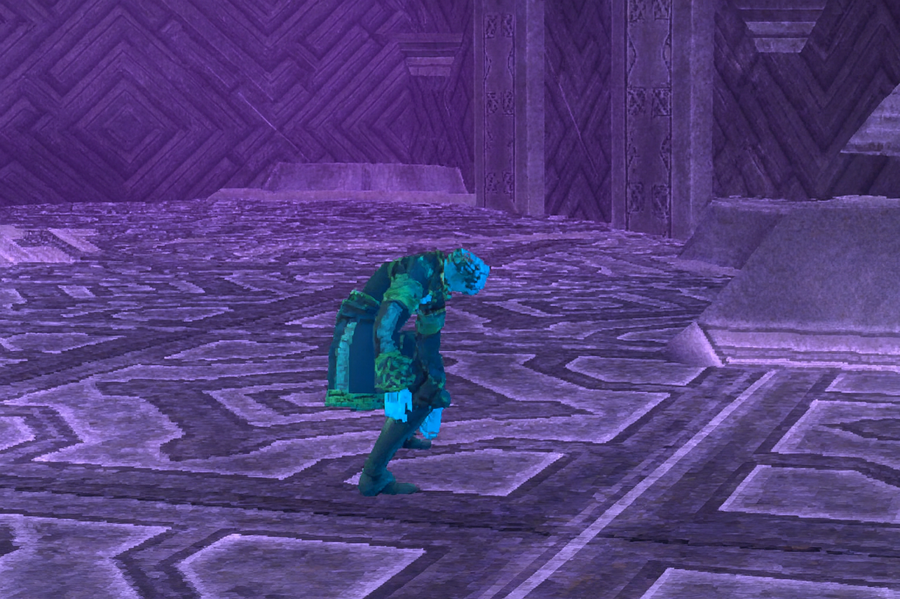
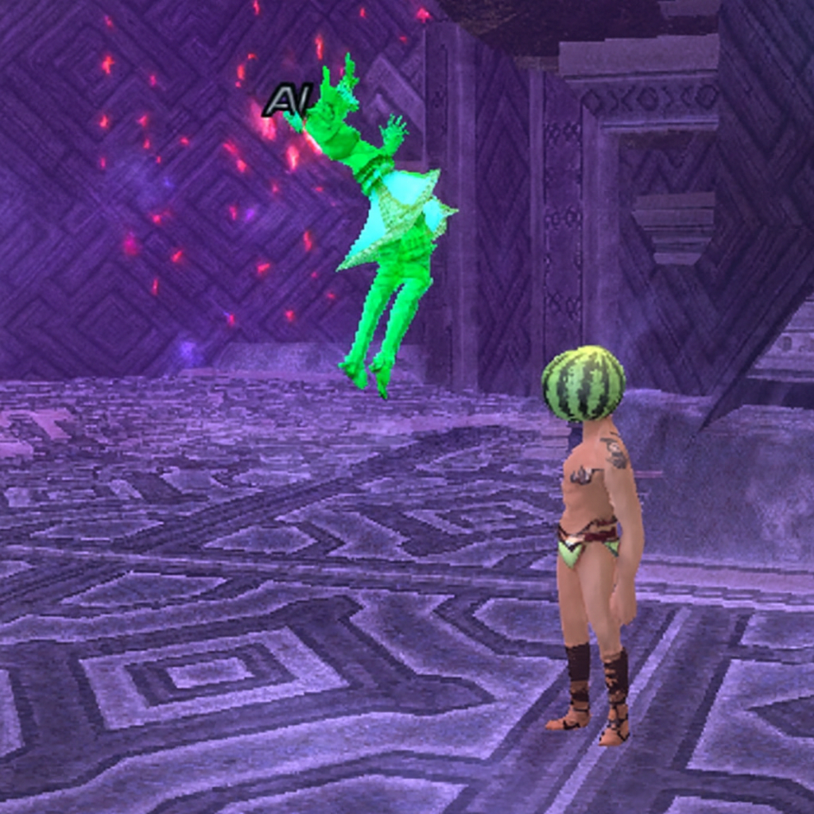

# ShinyReactor

**ShinyReactor** is a lightweight Ashiita v4 add-on for *Final Fantasy XI* that monitors player or enemy actions, abilities, and combat events, and will then trigger custom reactions or visual cues, automation, or logging — in real time. It’s designed for speed, clarity, and modularity within the Ashita environment. In addition to that, it is designed to help folks with low vision be able to discern when to nuke the correct spell against Aminon, Aita and Degei.

---

## ✨ Features

- 🔁 Reacts to in-game actions and battle events dynamically  
- 🧩 Modular design for easy event expansion  
- ⚡ Lightweight, asynchronous Lua architecture  
- 🎨 Color-coded feedback and customizable UI elements (via ImGui)  
- 🔍 Configurable filters for jobs, abilities, or mob targets  
- 💾 Persistent configuration between sessions  

---

## 📦 Installation

1. Download or clone this repository:
   ```bash
   git clone https://github.com/<your-username>/shinyreactor.git
   ```
2. Place the shinyreactor folder into your Ashita `addons/` directory:
   ```
   Ashita/addons/shinyreactor/
   ```
3. Place reactions lua files in your `config/addongs/shinyreactor/` directory:
   ```
   Ashita/config/addons/shinyreactor/turn.lua	#This contains to turn towards or away from enemies when certain abilities are used.
   Ashita/config/addons/shinyreactor/sortie.lua	#This contains reactions for sortie (and color visual cues)
   Ashita/config/addons/shinyreactor/test.lua	#This is just an example file you can load to test things
   ```
4. Load shinyreactor:
   ```
   /addon load shinyreactor
   ```
5. Load any config file with responses you'd like. (This will load turn towards/away reactions).
   ```
   /sreact load turn
   ```

---

## ⚙️ Configuration

Settings are stored in lua files or within the `/config/addons/shinyreactor` directory.  You can edit it manually or and load them using in-game slash commands.

### Example #1 (Responding to abilities or Spells):
When any anyone uses Claw Cyclone or Razor Fang, your character will react with  Violent Flourish
When any anyone uses Stoneskin, they will appear Purple and you'll see an echo statement on your chat window. 
```lua
c = require('colors')
return {
    {
        Abilities = { 'Claw Cyclone', 'Razor Fang' },
        Users = '*',
        Reaction = '/ja "Violent Flourish" $user',
		Color = nil,	--No color applied
        MustTargetSelf = false,
    },
    {
        Abilities = { },
        Spells = { 'Stoneskin' },
        Users = '*',
        Reaction = '/echo Stoneskin = Purple',
		Color = c.purple,
        MustTargetSelf = true,
    },
};
```

### Example #2 (Turning Towards or Away):
When any anyone uses Apocalyptyic Ray, Afflicting Gaze or Dread Spikes, you will turn away from that enemy.
When any anyone uses Impale or Waning Vigor, turn towards them.
```lua
return {
	--Turn Away
    {
        Abilities = { 'Afflicting Gaze', 'Apocalyptic Ray'},
        Spells = { 'Dread Spikes', },
        Users = {'*'},
        Reaction = '/turn awayfrom $userindex',
        MustTargetSelf = false,
    },

	--Turn Towards
    {
        Abilities = { 'Impale', 'Waning Vigor' },
        Users = {'*'},
        Reaction = '/turn toward $userindex',
        MustTargetSelf = false,
    },
};
```

### Example #3 (Useful sortie-specific responses and color changes):

#### Degei/Aita does Flaming Kick and turns Blue!
When Degei/Aita does Eroding Flesh, /echo that it's time to nuke Aero and change Degei/Aita to a shade of Blue



#### Degei/Aita does Eroding Flesh and turns Green!
When Degei/Aita does Eroding Flesh, /echo that it's time to nuke Aero and change Degei/Aita to a shade of Green.



```lua
c = require('colors')
return {
    {
        Abilities = { 'Flaming Kick', },
        Spells = { },
        Users = {'Degei', 'Aita'},
        Reaction = '/echo $action - Time to nuke Water',
		Color = c.blue,
        MustTargetSelf = false,
    },
    {
        Abilities = { 'Eroding Flesh', },
        Spells = { },
        Users = {'Degei', 'Aita'},
        Reaction = '/echo $action - Time to nuke Aero',
		Color = c.green,
        MustTargetSelf = false,
    },
};
```


---

## 💬 Commands

| Command | Description |
|----------|-------------|
| `/sr` | Toggles ShinyReactor on/off |
| `/sr load FILE` | Loads Lua file containing reactions |
| `/sreact` | Alias for `/sr` |
| `/sreactor` | Alias for `/sr` |
| `/shinyreact` | Alias for `/sr` |


---

## 🧠 How It Works

ShinyReactor hooks into the game’s action stream and event packets.  
When it detects a player or mob action matching a trigger condition, it executes the corresponding reaction handler.

---

## 👤 Author

Mostly Thorny, some help from Atomos' Ashita V4 repository [here](https://pages.github.com/) (currently in beta), and a tiny bit by Fel.
Contributions and suggestions welcome!

---

*Last updated on 2025-10-27*
